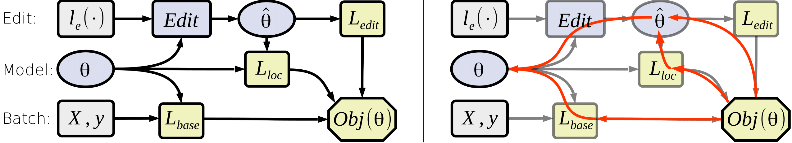

# Editable neural networks

A supplementary code for [Editable Neural Networks](https://openreview.net/forum?id=HJedXaEtvS), an ICLR 2020 submission by Anton Sinitsin, Vsevolod Plokhotnyuk, Dmitry Pyrkin, Sergei Popov, Artem Babenko.

# What does it do?

It trains a model so that it can later be edited: forced to predict a specific class on a specific input without losing accuracy.

# What do i need to run it?
* A machine with some CPU (preferably 2+ free cores) and GPU(s)
  * Running without GPU is possible but does not scale well, especially for ImageNet
* Some popular Linux x64 distribution
  * Tested on Ubuntu16.04, should work fine on any popular linux64 and even MacOS;
  * Windows and x32 systems may require heavy wizardry to run;
  * When in doubt, use Docker, preferably GPU-enabled (i.e. nvidia-docker)

# How do I run it?
1. Clone or download this repo. `cd` yourself to it's root directory.
2. Grab or build a working python enviromnent. [Anaconda](https://www.anaconda.com/) works fine.
3. Install packages from `requirements.txt`
4. Run jupyter notebook and open a notebook in `./notebooks/`
 * Before you run the first cell, change `%env CUDA_VISIBLE_DEVICES=#` to an index that you plan to use.
 * [CIFAR10 notebook](./notebooks/cifar10_editable_layer3.ipynb) can be ran with no extra preparation
 * The ImageNet notebooks require a step-by-step procedure to get running:
   1. Download the dataset first. See [this page](https://pytorch.org/docs/stable/_modules/torchvision/datasets/imagenet.html) or just google it. No, really, go google it!
   2. Run [`imagenet_preprocess_logits.ipynb`](./notebooks/imagenet_preprocess_logits.ipynb)
   3. Train with [`imagenet_editable_training.ipynb`](./notebooks/imagenet_editable_training.ipynb)
   4. Evaluate by using one of the two remaining notebooks.
 * To reproduce machine translation experiments, follow the instructions in [`./mt/README.md`](./mt/)
